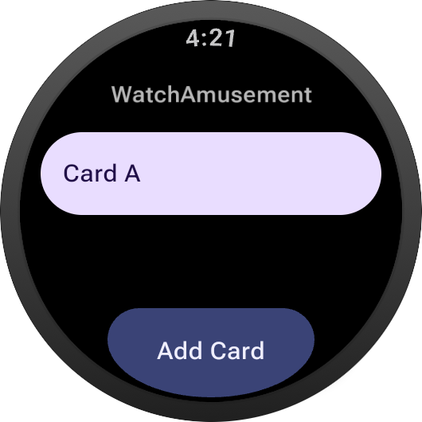
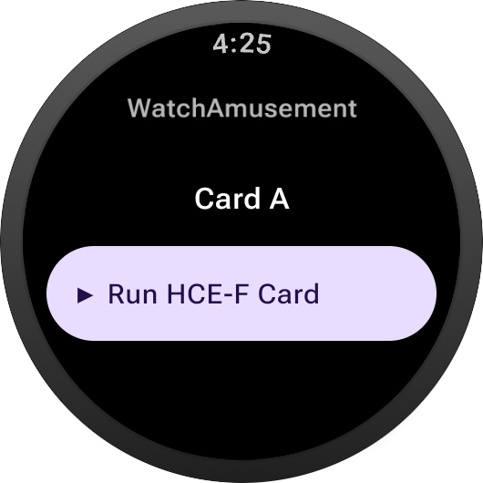

# WatchAmusement
Android 기반 Wear OS 기기에서 HCE-F를 통해 FeliCa 카드를 에뮬레이팅 하는 앱입니다.

## 요구사항
* Wear OS를 구동하는 기기
  * Wear OS 3(Android 11) 이상
  * NFC 및 HCE-F 지원
* adb로 워치에 앱을 설치할 수 있는 지식

## 작동 방식
Android의 `NfcFCardEmulation` API를 이용하여 FeliCa 카드를 에뮬레이팅 합니다.
* IDm: `02FE`로 시작하는 번호
  * 추가 및 변경시 랜덤으로 생성됩니다.
  * 단, 앞 4자리는 API 제약으로 인해 다른 대역을 사용할 수 없어 `02FE`로 고정됩니다.
  
* PMm: `0118`로 시작하는 번호 
  * Mobile FeliCa 4.1에서 사용하는 대역입니다.
  
## 스크린샷
| 카드 목록 화면 | 카드 정보 화면 | 
|----------------|----------------|
|  |  |

## 이슈 및 PR
대충 짠거라 환영합니다만 바로 반영은 힘들 수 있습니다.

## 만들면서 참고한 것들
[FeliCa Card Conversion - Arcade Docs](https://sega.bsnk.me/allnet/aimedb/felica/): 특정 게임 기기에서 인식하는 카드 범위를 참고하였습니다.

[juchan1220/eAMEMu_RN](https://github.com/juchan1220/eAMEMu_RN) 및 [C-F0x/KonamikU](https://github.com/C-F0x/KonamikU): 아이디어를 얻고, 위 방식이 잘 작동하는지 확인하기 위한 테스트 앱을 만드는 데 참고하였습니다.

## 라이선스
[LICENSE](LICENSE) 및 [THIRD_PARTY_NOTICES.md](THIRD_PARTY_NOTICES.md) 파일을 확인해주세요.
